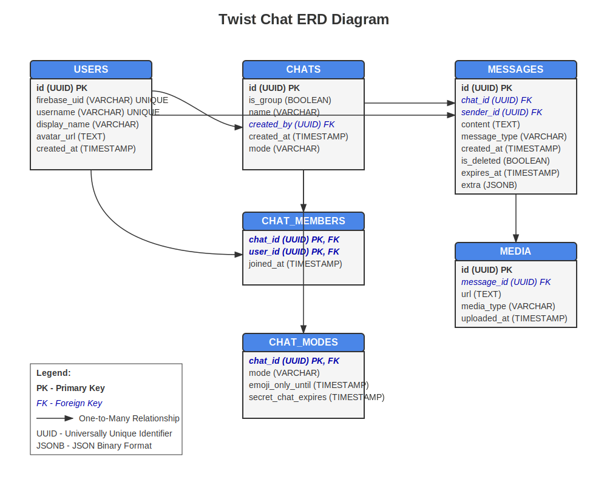

# Twist Chat

A modern chat application with multiple chat modes and rich media support. This project was created using the [Ktor Project Generator](https://start.ktor.io).

Here are some useful links to get you started:

- [Ktor Documentation](https://ktor.io/docs/home.html)
- [Ktor GitHub page](https://github.com/ktorio/ktor)
- The [Ktor Slack chat](https://app.slack.com/client/T09229ZC6/C0A974TJ9). You'll need
  to [request an invite](https://surveys.jetbrains.com/s3/kotlin-slack-sign-up) to join.

## Features

Here's a list of features included in this project:

| Name                                                               | Description                                                                        |
|--------------------------------------------------------------------|------------------------------------------------------------------------------------|
| [CORS](https://start.ktor.io/p/cors)                               | Enables Cross-Origin Resource Sharing (CORS)                                       |
| [Compression](https://start.ktor.io/p/compression)                 | Compresses responses using encoding algorithms like GZIP                           |
| [Default Headers](https://start.ktor.io/p/default-headers)         | Adds a default set of headers to HTTP responses                                    |
| [Routing](https://start.ktor.io/p/routing)                         | Provides a structured routing DSL                                                  |
| [Authentication](https://start.ktor.io/p/auth)                     | Provides extension point for handling the Authorization header                     |
| [Content Negotiation](https://start.ktor.io/p/content-negotiation) | Provides automatic content conversion according to Content-Type and Accept headers |
| [Call Logging](https://start.ktor.io/p/call-logging)               | Logs client requests                                                               |

## Building & Running

To build or run the project, use one of the following tasks:

| Task                          | Description                                                          |
|-------------------------------|----------------------------------------------------------------------|
| `./gradlew test`              | Run the tests                                                        |
| `./gradlew build`             | Build everything                                                     |
| `buildFatJar`                 | Build an executable JAR of the server with all dependencies included |
| `buildImage`                  | Build the docker image to use with the fat JAR                       |
| `publishImageToLocalRegistry` | Publish the docker image locally                                     |
| `run`                         | Run the server                                                       |
| `runDocker`                   | Run using the local docker image                                     |

If the server starts successfully, you'll see the following output:

```
2024-12-04 14:32:45.584 [main] INFO  Application - Application started in 0.303 seconds.
2024-12-04 14:32:45.682 [main] INFO  Application - Responding at http://0.0.0.0:8080
```

## Database Schema

The application uses a PostgreSQL database with the following structure:

### Core Tables

#### Users Table
Stores user account information with fields for:
- id (UUID, Primary Key)
- firebase_uid (VARCHAR, Unique)
- username (VARCHAR, Unique)
- display_name (VARCHAR)
- avatar_url (TEXT)
- created_at (TIMESTAMP)

#### Chats Table
Represents conversations between users with fields for:
- id (UUID, Primary Key)
- is_group (BOOLEAN)
- name (VARCHAR)
- created_by (UUID, Foreign Key to users)
- created_at (TIMESTAMP)
- mode (VARCHAR) - 'normal', 'emoji_only', 'secret', 'draw'

#### Chat Members Table
Links users to the chats they're part of with fields for:
- chat_id (UUID, Primary Key, Foreign Key to chats)
- user_id (UUID, Primary Key, Foreign Key to users)
- joined_at (TIMESTAMP)

#### Messages Table
Stores all messages sent in chats with fields for:
- id (UUID, Primary Key)
- chat_id (UUID, Foreign Key to chats)
- sender_id (UUID, Foreign Key to users)
- content (TEXT)
- message_type (VARCHAR) - 'text', 'emoji', 'image', 'drawing', 'voice'
- created_at (TIMESTAMP)
- is_deleted (BOOLEAN)
- expires_at (TIMESTAMP) - for secret chat auto-delete
- extra (JSONB) - for storing drawing data, etc.

#### Media Table
Stores media files shared in messages with fields for:
- id (UUID, Primary Key)
- message_id (UUID, Foreign Key to messages)
- url (TEXT)
- media_type (VARCHAR) - 'image', 'voice', 'drawing'
- uploaded_at (TIMESTAMP)

#### Chat Modes Table (Optional)
Provides additional settings for different chat modes with fields for:
- chat_id (UUID, Primary Key, Foreign Key to chats)
- mode (VARCHAR) - 'normal', 'emoji_only', 'secret', 'draw'
- emoji_only_until (TIMESTAMP)
- secret_chat_expires (TIMESTAMP)

## Entity Relationship Diagram (ERD)



## Chat Application Features

- User authentication via Firebase
- One-on-one and group chats
- Multiple chat modes:
  - Normal text chat
  - Emoji-only mode
  - Secret chats with auto-deletion
  - Drawing mode
- Rich media support:
  - Text messages
  - Emoji messages
  - Image sharing
  - Voice messages
  - Drawing sharing
- Message expiration for secret chats

## System Design

The database design supports a flexible chat application where:

1. Users can create different types of conversations (one-on-one or groups)
2. Different message types are supported (text, emoji, media, drawings)
3. Special chat modes can be enabled (emoji-only, secret chats with auto-deletion)
4. Media files are properly tracked and linked to their messages
5. The relationships between users, chats, and messages are clearly defined

The database uses UUIDs for IDs and references between tables to maintain data integrity (making sure, for example, that messages can't exist without a valid chat).

